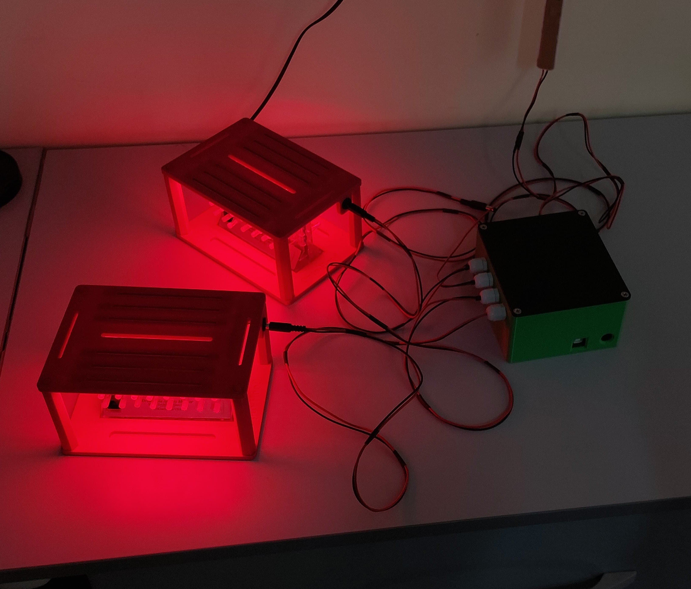

# Opto-Hood
Low cost system for optogenetically manipulating neurons while simultaneously recording sleep/activity in Drosophila Activity Monitors.

## Description
The Opto-Hood is a system that allows optogenetic activation(or silencing) of neurons in fruit flies housed in Drosophila Activity Monitors(DAMs). At its heart is an Arduino Uno that controls the duration and frequency of the LEDs that are place over the DAM monitors(like a hood).The system is low cost, and can be built using off-the-shelf electronics. User inputs are acquired through the Arduino IDE hence does not require sophisticated software. Up to four DAMs can be controlled independently by one device.

Detailed info can be found on my [Hackaday page](https://hackaday.io/project/197842-opto-hood)
